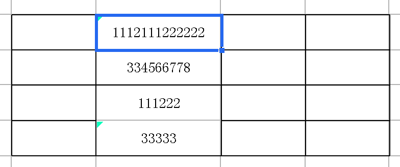

# 分数线形态

## 插件编译
将帆软报表安装目录下的相关jar包:

$installDir/fr-designer-core-8.0.jar

$installDir/fr-designer-chart-8.0.jar

$installDir/fr-designer-report-8.0.jar

$installDir/WebReport/WEB-INF/lib/fr-core-8.0.jar

$installDir/WebReport/WEB-INF/lib/fr-chart-8.0.jar

$installDir/WebReport/WEB-INF/lib/fr-report-8.0.jar

$installDir/WebReport/WEB-INF/lib/fr-platform-8.0.jar

$installDir/WebReport/WEB-INF/lib/fr-third-8.0.jar

拷贝到项目工程的lib/report目录下（如果没有该目录则自行新建）

然后执行ant命名来编辑插件包：
`ant -f build.xml jar`

## 插件安装
使用帆软设计器自带的插件管理器即可安装。
## 插件使用
如设计器中下图所示的模板：

可以设置分数线由分子决定（位置需要选择"下"）：

也可以设置分数线由分母决定（位置需要选择"上"）：

如果希望分子分母都显示成相同的效果，不管设置了分数线以分子显示还是分母显示，另一个要相应的设置线条为"无"。

最终的效果图：

分子分母都为空的时候，依然显示分数线。

